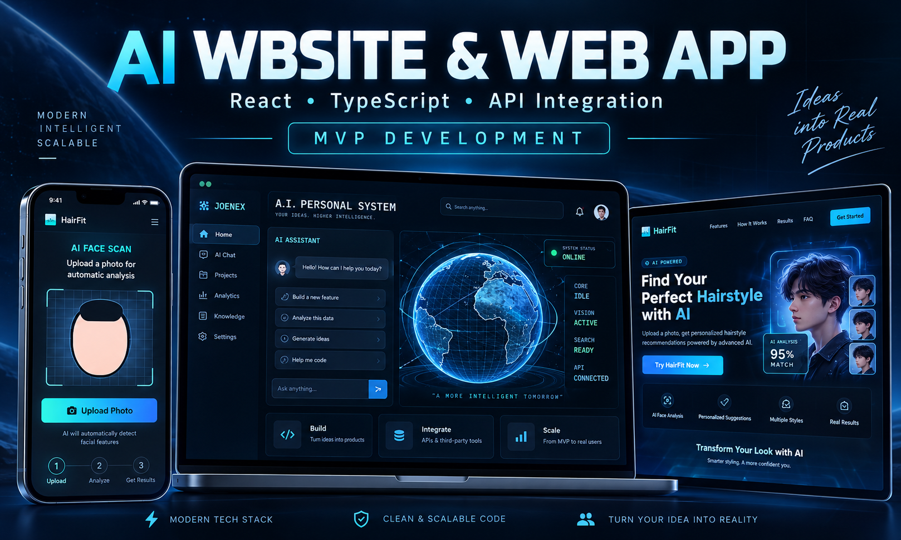
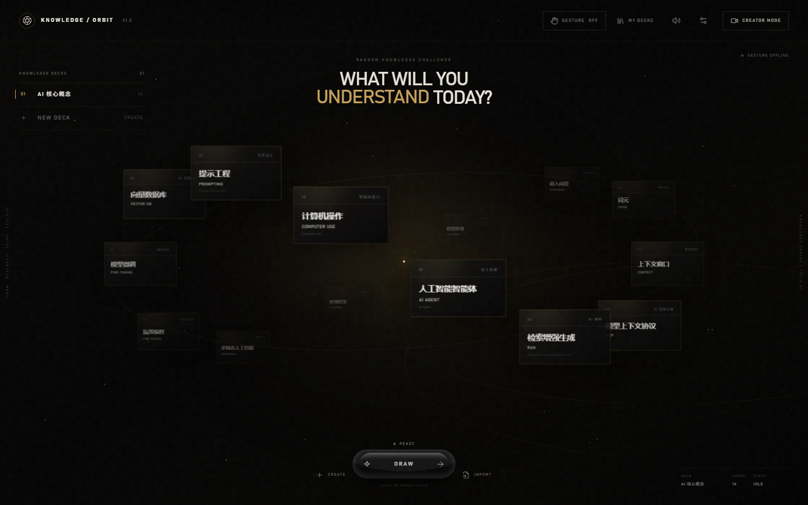
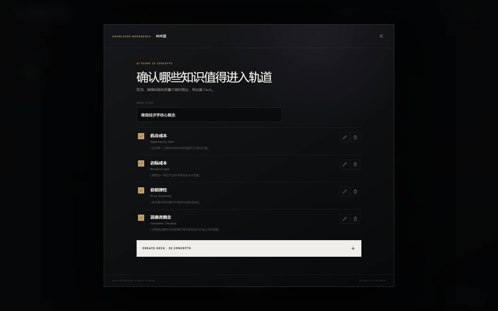
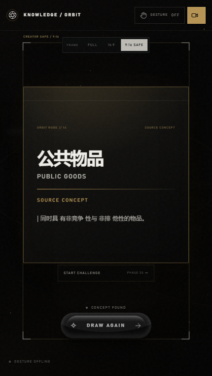

# JOENEX / Knowledge Orbit

> A cinematic, interactive web experience for discovering what to learn next.



## Overview

Knowledge Orbit is a personal JOENEX product prototype that turns a collection of ideas into an engaging spatial experience. Instead of browsing a conventional list or flashcard grid, users spin an animated orbit, land on a concept, and choose what to explore next.

The project demonstrates how a branded web product can combine clear information design, motion, sound, 3D atmosphere, content-management tools, and experimental AI interaction in one responsive interface. It was created as a portfolio piece for prospective clients looking for polished React websites, interactive dashboards, MVPs, or AI-enabled product concepts.

## Live Demo

**[Open the live Knowledge Orbit experience →](https://knowledge-orbit.netlify.app)**

Click **DRAW** or press the space bar to run the selector. The workbench also allows you to create decks, add concepts, import content, adjust sound, and enable optional camera-based gesture controls.

For the best first experience, use a modern desktop browser. Mobile layouts and Creator Mode are also supported.

The demo is hosted on Netlify over HTTPS. No account or API key is needed to try the orbit, decks, import preview, or Creator Mode.

- **Camera is optional:** enable it from the Gesture panel. Permission denial or model-loading failure leaves mouse, touch, and keyboard controls available. Hand tracking runs in the browser; camera frames are not uploaded.
- **Sound starts after interaction:** browser autoplay restrictions may keep audio silent until you click or tap. Microphone and location access are not used.
- **Local data only:** decks and settings are saved in this browser, not synced to an account. Avoid importing confidential content into a public portfolio demo.
- **Optional AI is BYOK:** no OpenAI service or shared API key is configured. The OpenRouter prototype sends submitted source text to OpenRouter only when you choose that route with your own key. That key is saved in this browser's local storage; it is not a production-grade secret vault. Do not enter a key on a shared device, and clear it in Settings after testing.

See [deployment notes](docs/deployment.md) for hosting settings and browser requirements.

## Key Features

- **Cinematic knowledge draw** — randomized selection with acceleration, deceleration, reveal states, and synchronized mechanical sound.
- **Interactive knowledge dashboard** — create, duplicate, select, and manage bilingual knowledge decks directly in the browser.
- **Flexible content input** — add concepts one at a time, paste a batch list, import source text, or extract text from supported PDFs.
- **Concept review workflow** — review, edit, select, or remove extracted concepts before creating a new deck.
- **3D visual atmosphere** — Three.js ambience combined with layered card motion and a custom dark editorial interface.
- **Gesture control** — MediaPipe hand tracking lets an open palm start the orbit and a closed hand lock the selected card.
- **Creator Mode** — 9:16 and 16:9 safe-frame previews designed for recording social and presentation content.
- **Responsive interaction** — keyboard, mouse, touch, reduced-motion support, local persistence, and procedural audio.
- **Optional AI extraction** — a working prototype can call OpenRouter with a user-supplied key; a local preview route is available without a key.

## Tech Stack

| Technology | Role in the product |
| --- | --- |
| React 19 + TypeScript | Component-based interface and reliable application logic |
| Vite | Fast local development and production builds |
| Three.js + React Three Fiber | Animated 3D background atmosphere |
| Framer Motion | Orbit movement, transitions, and reveal choreography |
| Zustand | Deck, settings, and experience state with browser persistence |
| MediaPipe Tasks Vision | On-device hand-gesture recognition |
| PDF.js | In-browser text extraction from text-based PDF files |
| Web Audio API | Procedural selector and reveal sound design |
| Tailwind CSS + custom CSS | Responsive layout and the JOENEX visual system |
| Netlify | Hosting for the current live prototype |

## Screenshots

### Main interactive orbit



### Concept review workbench



### Mobile Creator Mode



## Local Setup

Requirements: Node.js 22 and npm.

```bash
git clone https://github.com/gzhaoyu7-del/joenex-ai-personal-system.git
cd joenex-ai-personal-system
npm ci
npm run dev
```

Open the local URL printed by Vite. The default experience does not require an environment file or external API key.

Quality and production checks:

```bash
npm run lint
npm run build
npm run preview
```

## Project Status

This repository is a **personal project and product prototype**. It is a working portfolio demonstration, not a production SaaS service.

### Completed

- Animated knowledge orbit, randomized draw, and selected-card reveal
- Built-in and user-created decks with browser persistence
- Manual and batch concept entry
- Text and text-based PDF ingestion with editable concept review
- Responsive desktop and mobile layouts
- Creator Mode framing, gesture input, and procedural sound
- Local semantic preview and optional OpenRouter BYOK extraction

### Prototype or planned

- **OpenRouter integration:** functional as a client-side BYOK prototype, but production use requires a server-side proxy and secure secret handling.
- **PDF support:** text-based PDFs are supported; scanned-document OCR is not implemented.
- **Challenge Mode:** the visible action is reserved for a later phase and is currently disabled.
- **Voice assistant:** planned concept; voice input and conversational control are not implemented.
- **Production platform features:** authentication, cloud sync, payments, analytics, backend AI routing, and production-grade key management are not included.

No API keys, private credentials, or environment configuration are bundled with this repository.
